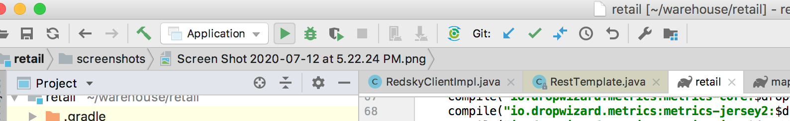
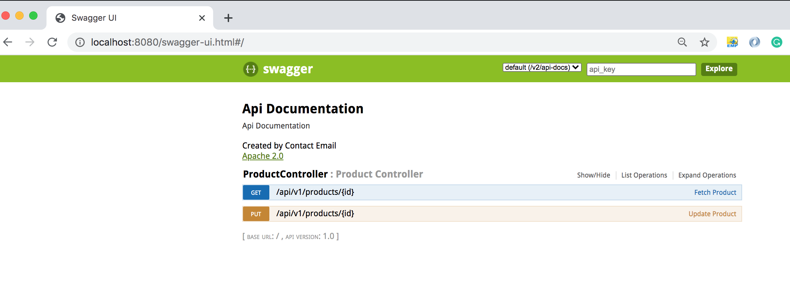
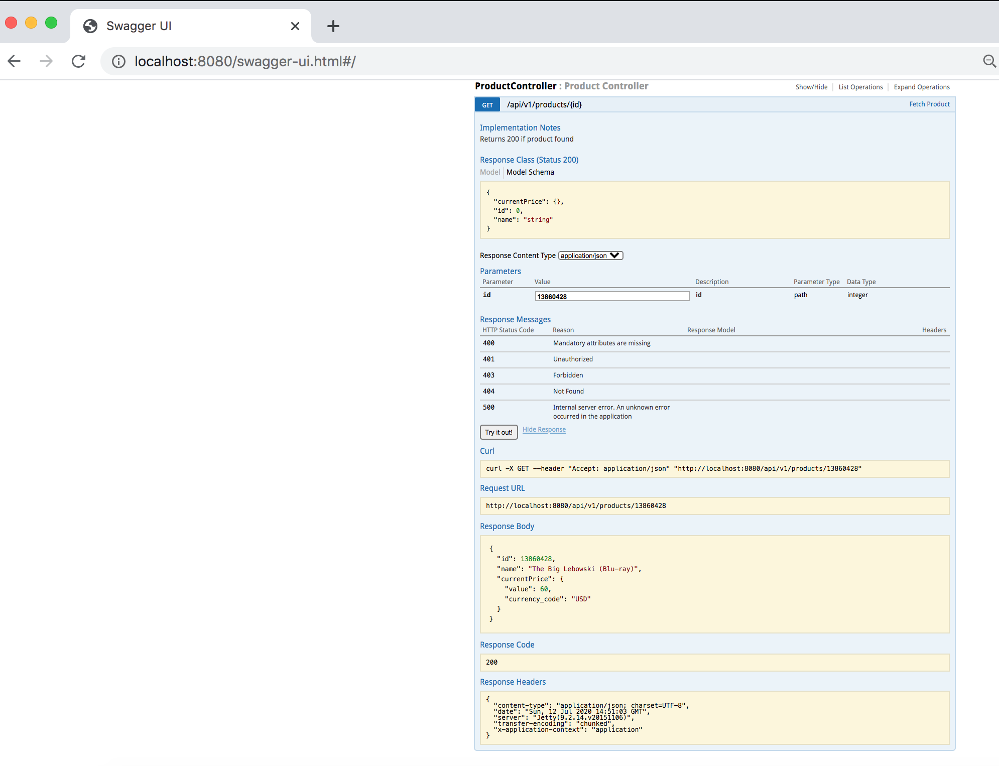
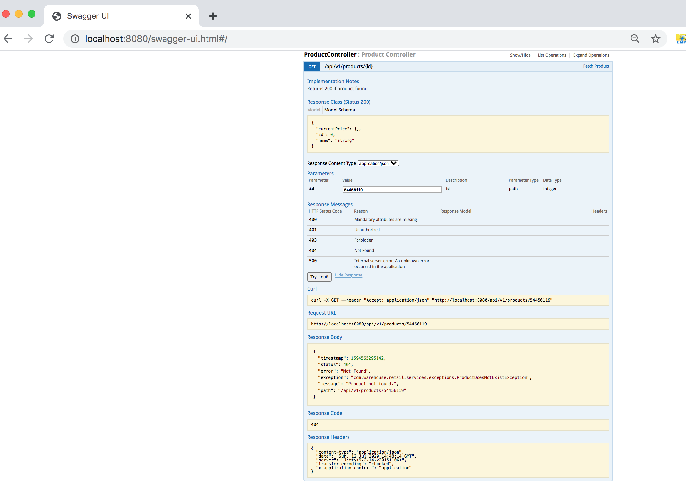

# retail

# __Problem Statement:__

Requirement is to build RESTful service with following features.

MyRetail is a rapidly growing company with HQ in Richmond, VA and over 200 stores across the east coast. myRetail wants to make its internal data available to any number of client devices, from myRetail.com to native mobile apps.

The goal for this exercise is to create an end-to-end Proof-of-Concept for a products API,which will aggregate product data from multiple sources and return it as JSON to the caller.

Your goal is to create a RESTful service that can retrieve product and price details by ID.The URL structure is up to you to define, but try to follow some sort of logical convention.

Build an application that performs the following actions:

 Responds to an HTTP GET request at /products/{id} and delivers product data as JSON (where {id} will be a number.
Example product IDs: 13860428, 54456119, 13264003, 12954218)

 Example response: {&quot;id&quot;:13860428,&quot;name&quot;:&quot;The Big Lebowski (Blu-ray)
(Widescreen)&quot;,&quot;current_price&quot;:{&quot;value&quot;: 13.49,&quot;currency_code&quot;:&quot;USD&quot;}}

 Performs an HTTP GET to retrieve the product name from an external API. (For
this exercise the data will come from redsky.target.com, but let’s just pretend
this is an internal resource hosted by myRetail) 

 Example:
http://redsky.target.com/v2/pdp/tcin/13860428?excludes=taxonomy,price,promotion,bulk_ship,rating_and_review_reviews,rating_and_review_statistics,question_answer_statistics

 Reads pricing information from a NoSQL data store and combines it with the product id and name from the HTTP request into a single response.

BONUS: Accepts an HTTP PUT request at the same path (/products/{id}),containing a JSON request body similar to the GET response, and updates the product’s price in the data store.

# __Solution:__

1) Rest Api for doing a get call which will fetch data from NOsql store and from the given end point of redsky, will merge both results and then create JSON resposne for api.
2) Rest API for doing the product mrp update once the id is validated by doig a get call to noSql store and then updating tghe price attribute in data store.
3) The classes and teh interfaces making sure that the service is loosely coupled and structured so that future changes can be easily accomodated. Like chaging the data store will require only implementing a new interface for the new data store.
4) Unit test cases for controller and service.

# __Tech Satck:__
1. FrameWork: SpringBoot

2. Data Store: MongoDb

3. Coding Language: Java

4. Springframework RestTemplate for calling to downstream services, used Mapstruct for converting POJO from one to another POJO (like from api dto to service dto)

5. Swagger supported UI for API calls

6. Unit Tests: JUnit, Mockito

7. Build: gradle

Mongo UI Tool: Robo 3T 1.3.1

# __Test Data:__
Valid Ids: Example product IDs: 13860428, 54456119, 13264003, 12954218
Product update request payload: 
{
    "id" : 13860428,
    "current_price" : {
        "value" : 50,
        "currency_code" : "USD"
    }
}

# __To Run Project:__

1. Seed Data For Mongo DB:

2. command to build Project: ./gradlew clean build

3. Command to run: Needs configuration in intellij under the path-> run -> edit configurations -> follow the screen shot to configure.

4. After this in Intellij click on the run application, screen shot attached.

5. To open the local swagger UI to use the api: 
URL: http://localhost:8080/swagger-ui.html#/

6. GET API request and resposne for fetch product detail:

7. GET API request and resposne for fetch product detai when product is not in data store.

